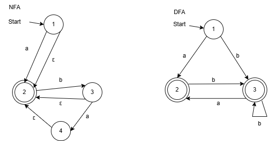

**2.4**
Added a recursive assemble function that maps the list given as arg using this mapping:
let sinstrToIntList sinstr =
match sinstr with
| SCstI i -> [0;i]
| SVar i -> [1;i]
| SAdd -> [2]
| SSub -> [3]
| SMul -> [4]
| SPop -> [5]
| SSwap -> [6]
Added example 'instruction' to test if our function works.

**2.5**
Changed the assemble function to take a filename and print the list of ints to the file.
The exercise askes us to modify the Machine.java file to support reading from a file, however it already does so by default so we have not included the file

**3.2**
a?(ba|b)*
The NFA and DFA can be found in the file 'NFAogDFA.png'

**3.3**
Main -> 
Expr eof -> 
Let NAME EQ Expr IN Expr End eof  ->
Let NAME EQ Expr IN Expr TIMES CSTINT End eof ->
Let NAME EQ Expr IN Expr PLUS Expr TIMES Expr End eof ->
Let NAME EQ Expr IN Expr PLUS Expr TIMES CSTINT End eof ->
Let NAME EQ Expr IN Expr PLUS CSTINT TIMES CSTINT End eof ->
Let NAME EQ Expr IN NAME PLUS CSTINT TIMES CSTINT End eof ->
Let NAME EQ LPAR Expr RPAR  IN NAME PLUS CSTINT TIMES CSTINT End eof ->
Let NAME EQ LPAR CSTINT RPAR  IN NAME PLUS CSTINT TIMES CSTINT End eof

**3.4**

